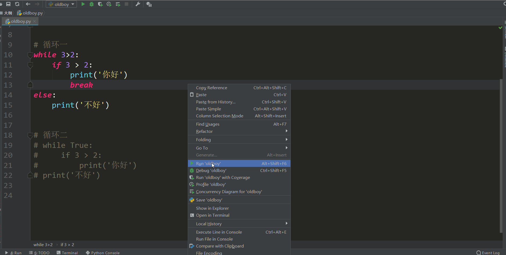

## while循环

while 循环
在生活中，我们遇到过循环的事情吧？比如循环听歌。在程序中，也是存才的，这就是流程控制语句 while

### 基本循环

```python
while 条件:
    # 循环体
    # 如果条件为真，那么循环则执行
    # 如果条件为假，那么循环不执行
```


条件如果为真就会一直执行下去  也就人们常说的死循环,我们想要停止就点那个红色的方块,如果点击的x的话,程序并没有停止,还在继续运行着

我们可以使用while循环进行内容循环,我们怎么能够让程序停止运行?

刚刚说到,死循环是因为条件一直都为真的时候,如果想让while循环停止最简单的方式就是将条件修改成假的,看下面示例

```python
flage = True
str_num = input("请输入要比较的数字:")
print("进入循环")
while flage:
  if "3" > str_num:
    print("在执行循环")
  else:
    print("要终止循环")
    flage = False
print("退出循环")
```

我们现在知道可以通过变量的形式改变while循环,我们还可以通过计数的方式来控制循环执行循环的次数,先来看一下

### 使用while计数

```python
count = 0
while True:
	count = count + 1
	print(count)
```


这样下去我就会执行下去,但是我想到100就停了

### 控制while循环的次数

```python
count = 0
while count < 100:
	count = count + 1
	print(count)
```


while 关键后边的是条件,这样就可以通过条件成功的控制住循环的次数,我们现在知道通过修改while后边的内容来终止循环,这是咱们自己想的办法,python这个编程语言中是不是应该也得有个终止循环的关键字什么的吧,我们来找一下试试      

### break关键字

我们除了可以使用条件能够让循环停止,其实Python还给我们提供了一个break关键字来停止循环

```python
num = 1
while num <6:
    print(num)
    num+=1
    break
    print("end")
```


当程序执行到break的时候就结束了.break就是结束当前这个while循环的 break以下的代码都不执行

### continue关键字

continue 用于退出当前循环，继续下一次循环

```python
num = 1
while num <6:
    print(num)
    num+=1
    continue
    print("end")
```


**注意:break是终止循环,continue是跳出本次循环,继续下次循环**

### while else使用

```python
# 循环一
while True:
    if 3 > 2:
        print('你好')
        break
else:
    print('不好')


# 循环二
while True:
    if 3 > 2:
        print('你好')
print('不好')

# 大家看到的这个是不是感觉效果是一样的啊,其实不然
# 当上边的代码执行到break的时候else缩进后的内容不会执行
```



这个执行的效果是因为

​	循环一执行了循环也执行了if条件打印了你好然后碰到break循环结束了

​	循环二执行了循环也执行了if条件打印了你好,但是没有break 就继续重复执行了

​	循环一将3>2改成3<2这个条件就不成立,然后执行了else里打印了不好

### while else 练习

首先让用户输入序号选择格式如下:

```python
0.退出
1.开始登录
如果用户选择序号0 就提示用户退出成功
如果用户选择序号1就让用户输入用户名密码然后进行判断,正确就终止循环,错误重新输入
```

