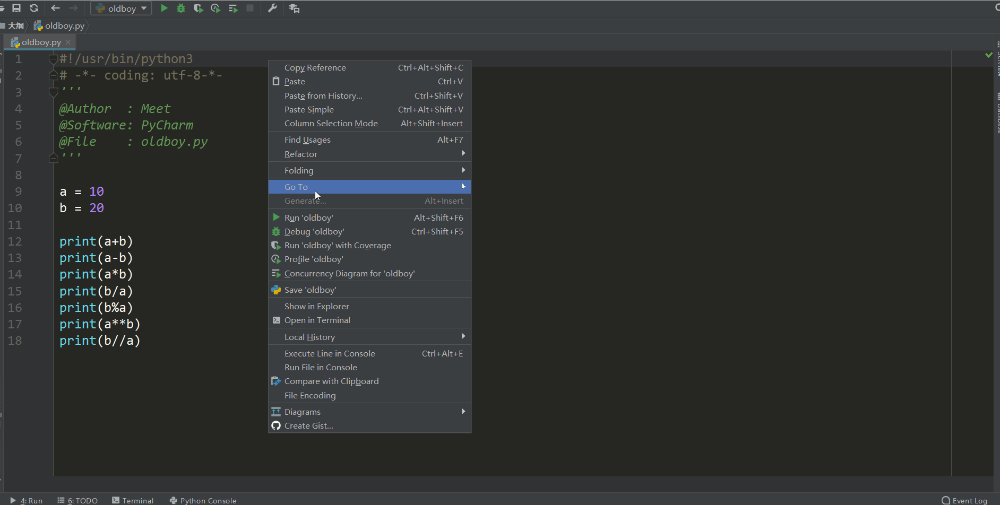
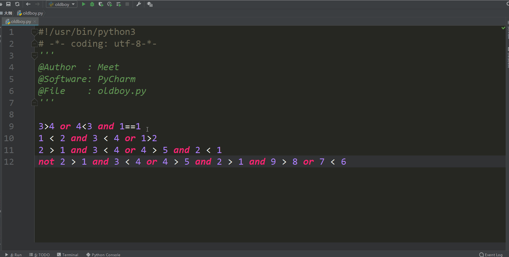

## 一.运算符

计算机可以进行的运算有很多种，可不只加减乘除这么简单，运算按种类可分为算数运算、比较运算、逻辑运算、赋值运算、成员运算、身份运算、位运算.

今天我们暂只学习 算数运算、比较运算、逻辑运算、赋值运算、成员运算

### 1.1 算数运算

以下假设变量：a=10，b=20




### 1.2 比较运算

以下假设变量：a=10，b=20


### 1.3 赋值运算

以下假设变量：a=10，b=20


### 1.4 逻辑运算


针对逻辑运算的进一步研究：

在没有()的情况下not 优先级高于 and，and优先级高于or，即优先级关系为( )>not>and>or，同一优先级从左往右计算。

例题：

判断下列逻辑语句的True，False。

x or y , x为真，值就是x，x为假，值是y；

x and y, x为真，值是y,x为假，值是x。

```python
3>4 or 4<3 and 1==1
1 < 2 and 3 < 4 or 1>2 
2 > 1 and 3 < 4 or 4 > 5 and 2 < 1
not 2 > 1 and 3 < 4 or 4 > 5 and 2 > 1 and 9 > 8 or 7 < 6
```




例题：求出下列逻辑语句的值。

```python
8 or 4
0 and 3
0 or 4 and 3 or 7 or 9 and 6
```

### 1.5 成员运算

in    not in :

判断子元素是否在原字符串（字典，列表，集合）中：

例如：

```python
#print('喜欢' in 'dkfljadklf喜欢hfjdkas')
#print('a' in 'bcvd')
#print('y' not in 'ofkjdslaf')
```

## 