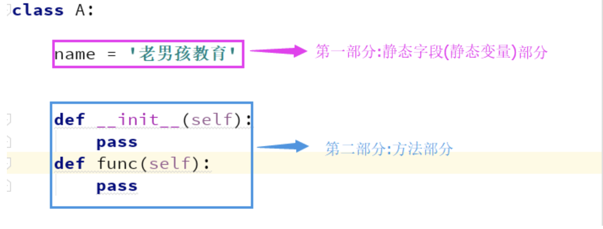

# Python面向对象之类成员

## 一.细分类的组成成员

之前咱们讲过类大致分两块区域，如下图所示：



每个区域详细划分又可以分为：

```python
class A:

    company_name = '老男孩教育'  # 静态变量(静态字段)
    __iphone = '1353333xxxx'  # 私有静态变量(私有静态字段)


    def __init__(self,name,age): #特殊方法

        self.name = name  #对象属性(普通字段)
        self.__age = age  # 私有对象属性(私有普通字段)

    def func1(self):  # 普通方法
        pass

    def __func(self): #私有方法
        print(666)


    @classmethod  # 类方法
    def class_func(cls):
        """ 定义类方法，至少有一个cls参数 """
        print('类方法')

    @staticmethod  #静态方法
    def static_func():
        """ 定义静态方法 ，无默认参数"""
        print('静态方法')

    @property  # 属性
    def prop(self):
        pass
```


## 二. 类的私有成员

对于每一个类的成员而言都有两种形式：

- 公有成员，在任何地方都能访问
- 私有成员，只有在类的内部才能方法

**私有成员和公有成员的访问限制不同**：

静态字段(静态属性)

- 公有静态字段：类可以访问；类内部可以访问；派生类中可以访问
- 私有静态字段：仅类内部可以访问；

### 2.1 公有静态属性(字段)

```python
class C:

    name = "公有静态字段"

    def func(self):
        print C.name

class D(C):

    def show(self):
        print C.name


C.name         # 类访问

obj = C()
obj.func()     # 类内部可以访问

obj_son = D()
obj_son.show() # 派生类中可以访问

公有静态字段
```

### 2.2 私有静态属性(字段)

```python
class C:

    __name = "私有静态字段"

    def func(self):
        print C.__name

class D(C):

    def show(self):
        print C.__name


C.__name       # 不可在外部访问

obj = C()
obj.__name  # 不可在外部访问
obj.func()     # 类内部可以访问   

obj_son = D()
obj_son.show() #不可在派生类中可以访问  

私有静态字段
```

普通字段(对象属性)

- 公有普通字段：对象可以访问；类内部可以访问；派生类中可以访问
- 私有普通字段：仅类内部可以访问；

### 2.3 公有普通字段

```python
class C:
    
    def __init__(self):
        self.foo = "公有字段"

    def func(self):
        print self.foo 　#　类内部访问

class D(C):
    
    def show(self):
        print self.foo　＃　派生类中访问

obj = C()

obj.foo     # 通过对象访问
obj.func()  # 类内部访问

obj_son = D();
obj_son.show()  # 派生类中访问
```

### 2.4 私有对象属性

```python
class C:
    
    def __init__(self):
        self.__foo = "私有字段"

    def func(self):
        print self.foo 　#　类内部访问

class D(C):
    
    def show(self):
        print self.foo　＃　派生类中访问

obj = C()

obj.__foo     # 通过对象访问    ==> 错误
obj.func()  # 类内部访问        ==> 正确

obj_son = D();
obj_son.show()  # 派生类中访问  ==> 错误

私有普通字段
```

方法:

公有方法:对象可以访问；类内部可以访问；派生类中可以访问
私有方法:仅类内部可以访问；

### 2.5 公有方法

```python
class C:

    def __init__(self):
        pass
    
    def add(self):
        print('in C')

class D(C):

    def show(self):
        print('in D')
        
    def func(self):
        self.show()
obj = D()
obj.show()  # 通过对象访问   
obj.func()  # 类内部访问    
obj.add()  # 派生类中访问  
```

### 2.6 私有方法

```python
class C:

    def __init__(self):
        pass

    def __add(self):
        print('in C')

class D(C):

    def __show(self):
        print('in D')

    def func(self):
        self.__show()
obj = D()
obj.__show()  # 通过不能对象访问
obj.func()  # 类内部可以访问
obj.__add()  # 派生类中不能访问
```

总结:

对于这些私有成员来说,他们只能在类的内部使用,不能再类的外部以及派生类中使用.

*ps：非要访问私有成员的话，可以通过 对象._类__属性名,但是绝对不允许!!!*

*为什么可以通过._类__私有成员名访问呢?因为类在创建时,如果遇到了私有成员(包括私有静态字段,私有普通字段,私有方法)它会将其保存在内存时自动在前面加上_类名.*

## 三. 类的其他成员

这里的其他成员主要就是类方法：

方法包括：普通方法、静态方法和类方法，三种方法在**内存中都归属于类**，区别在于调用方式不同。

**实例方法**

​    定义：第一个参数必须是实例对象，该参数名一般约定为“self”，通过它来传递实例的属性和方法（也可以传类的属性和方法）；

​    调用：只能由实例对象调用。

**类方法**

​    定义：使用装饰器@classmethod。第一个参数必须是当前类对象，该参数名一般约定为“cls”，通过它来传递类的属性和方法（不能传实例的属性和方法）；

​    调用：实例对象和类对象都可以调用。

**静态方法**

​    定义：使用装饰器@staticmethod。参数随意，没有“self”和“cls”参数，但是方法体中不能使用类或实例的任何属性和方法；

​    调用：实例对象和类对象都可以调用。

**双下方法（后面会讲到）**

　定义：双下方法是特殊方法，他是解释器提供的 由爽下划线加方法名加爽下划线 __方法名__的具有特殊意义的方法,双下方法主要是python源码程序员使用的，

　　　　我们在开发中尽量不要使用双下方法，但是深入研究双下方法，更有益于我们阅读源码。

　调用：不同的双下方法有不同的触发方式，就好比盗墓时触发的机关一样，不知不觉就触发了双下方法，例如：__init__

#### 3.1 类方法

使用装饰器@classmethod。

原则上，类方法是将类本身作为对象进行操作的方法。假设有个方法，且这个方法在逻辑上采用类本身作为对象来调用更合理，那么这个方法就可以定义为类方法。另外，如果需要继承，也可以定义为类方法。

如下场景：

假设我有一个学生类和一个班级类，想要实现的功能为：
    执行班级人数增加的操作、获得班级的总人数；
    学生类继承自班级类，每实例化一个学生，班级人数都能增加；
    最后，我想定义一些学生，获得班级中的总人数。

**思考**：这个问题用类方法做比较合适，为什么？因为我实例化的是学生，但是如果我从学生这一个实例中获得班级总人数，在逻辑上显然是不合理的。同时，如果想要获得班级总人数，如果生成一个班级的实例也是没有必要的。

```python
class Student:
    
    __num = 0
    def __init__(self,name,age):
        self.name = name
        self.age= age
        Student.addNum()  # 写在__new__方法中比较合适，但是现在还没有学，暂且放到这里
        
    @classmethod
    def addNum(cls):
        cls.__num += 1

    @classmethod
    def getNum(cls):
        return cls.__num


a = Student('宝元', 18)
b = Student('武sir', 36)
c = Student('alex', 73)
print(Student.getNum())
```

#### 3.2 静态方法

使用装饰器@staticmethod

静态方法是类中的函数，不需要实例。静态方法主要是用来存放逻辑性的代码，逻辑上属于类，但是和类本身没有关系，也就是说在静态方法中，不会涉及到类中的属性和方法的操作。可以理解为，静态方法是个**独立的、单纯的**函数，它仅仅托管于某个类的名称空间中，便于使用和维护。

譬如，我想定义一个关于时间操作的类，其中有一个获取当前时间的函数。

```python
import time

class TimeTest(object):
    def __init__(self, hour, minute, second):
        self.hour = hour
        self.minute = minute
        self.second = second

    @staticmethod
    def showTime():
        return time.strftime("%H:%M:%S", time.localtime())


print(TimeTest.showTime())
t = TimeTest(2, 10, 10)
nowTime = t.showTime()
print(nowTime)
```

如上，使用了静态方法（函数），然而方法体中并没使用（也不能使用）类或实例的属性（或方法）。若要获得当前时间的字符串时，并不一定需要实例化对象，此时对于静态方法而言，所在类更像是一种名称空间。

其实，我们也可以在类外面写一个同样的函数来做这些事，但是这样做就打乱了逻辑关系，也会导致以后代码维护困难。

#### **3.3 属性**

**什么是特性property**

property是一种特殊的属性，访问它时会执行一段功能（函数）然后返回值

```python
例一：BMI指数（bmi是计算而来的，但很明显它听起来像是一个属性而非方法，如果我们将其做成一个属性，更便于理解）

成人的BMI数值：
过轻：低于18.5
正常：18.5-23.9
过重：24-27
肥胖：28-32
非常肥胖, 高于32
　　体质指数（BMI）=体重（kg）÷身高^2（m）
　　EX：70kg÷（1.75×1.75）=22.86
```

例一代码

```python
class People:
    def __init__(self,name,weight,height):
        self.name=name
        self.weight=weight
        self.height=height
    @property
    def bmi(self):
        return self.weight / (self.height**2)

p1=People('meet',100,1.85)
print(p1.bmi)
```

**为什么要用property**

将一个类的函数定义成特性以后，对象再去使用的时候obj.name,根本无法察觉自己的name是执行了一个函数然后计算出来的，这种特性的使用方式**遵循了统一访问的原则**

**由于新式类中具有三种访问方式，我们可以根据他们几个属性的访问特点，分别将三个方法定义为对同一个属性：获取、修改、删除**

```python
class Foo:
    @property
    def AAA(self):
        print('get的时候运行我啊')

    @AAA.setter
    def AAA(self,value):
        print('set的时候运行我啊')

    @AAA.deleter
    def AAA(self):
        print('delete的时候运行我啊')

#只有在属性AAA定义property后才能定义AAA.setter,AAA.deleter
f1=Foo()
f1.AAA
f1.AAA='aaa'
del f1.AAA

或者：
class Foo:
    def get_AAA(self):
        print('get的时候运行我啊')

    def set_AAA(self,value):
        print('set的时候运行我啊')

    def delete_AAA(self):
        print('delete的时候运行我啊')
    AAA=property(get_AAA,set_AAA,delete_AAA) #内置property三个参数与get,set,delete一一对应

f1=Foo()
f1.AAA
f1.AAA='aaa'
del f1.AAA
```

商品示例:

```python
class Goods(object):

    def __init__(self):
        # 原价
        self.original_price = 100
        # 折扣
        self.discount = 0.8

    @property
    def price(self):
        # 实际价格 = 原价 * 折扣
        new_price = self.original_price * self.discount
        return new_price

    @price.setter
    def price(self, value):
        self.original_price = value

    @price.deltter
    def price(self, value):
        del self.original_price

obj = Goods()
obj.price         # 获取商品价格
obj.price = 200   # 修改商品原价
del obj.price     # 删除商品原价
```


##  四. isinstace 与 issubclass

```python
class A:
    pass

class B(A):
    pass

obj = B()


print(isinstance(obj,B))
print(isinstance(obj,A))
```

## 4.1 isinstance(a,b)

判断a是否是b类（或者b类的派生类）实例化的对象

```python
class A:
    pass

class B(A):
    pass

class C(B):
    pass

print(issubclass(B,A))
print(issubclass(C,A))
```

## 4.2 issubclass(a,b)

判断a类是否是b类（或者b的派生类）的派生类

思考：那么 list str tuple dict等这些类与 Iterble类 的关系是什么？

```python
from collections import Iterable

print(isinstance([1,2,3], list))  # True
print(isinstance([1,2,3], Iterable))  # True
print(issubclass(list,Iterable))  # True

# 由上面的例子可得，这些可迭代的数据类型，list str tuple dict等 都是 Iterable的子类。
```

